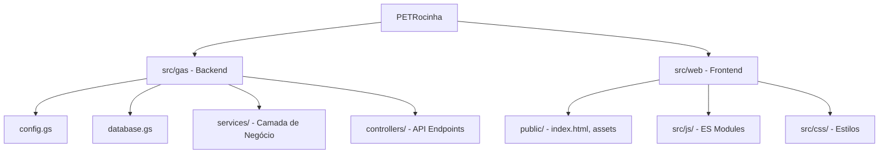

# Plano de Reestruturação Arquitetural - PETRocinha

Este plano visa a modernização, manutenibilidade e escalabilidade do projeto PETRocinha.

## 1. Nova Hierarquia de Diretórios

A estrutura será dividida rigorosamente entre a lógica de servidor (Google Apps Script) e o frontend (Assets Web).

## 2. Estratégia de Modularização

- **Migração para ES Modules**: Todo o código JavaScript do frontend será convertido para módulos utilizando `import` e `export`.
- **Remoção de Globais**: Eliminação de variáveis e funções no escopo `window`. Encapsulamento em classes ou módulos de serviço.
- **Event Listeners**: Substituição de todos os atributos `onclick` e similares no `index.html` por `addEventListener` programáticos em `src/js/events.js`.

## 3. Consolidação do SPA (Single Page Application)

- **Index.html Único**: O arquivo `index.html` servirá apenas como *container* (layout base).
- **Roteamento**: Implementação de um sistema de roteamento baseado em *hash* ou *History API* para renderização dinâmica de componentes.
- **Sincronização**: Todo o conteúdo dinâmico será injetado via módulos JS, garantindo que o DOM reflita o estado da aplicação.

## 4. Estrutura Final

A estrutura final permitirá:
- **Escalabilidade**: Adição facilitada de novos serviços e funcionalidades.
- **Manutenibilidade**: Separação clara de responsabilidades entre backend e frontend.
- **Performance**: Carregamento otimizado através de módulos JS.
